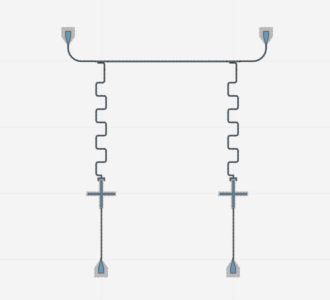

# Qiskit Metal - 2Qubits Cross Transmon

## Tools

- Jupyter Notebook
- Qiskit Metal

## Features

- Qiskit Metal Layout

## Demonstration

#### Qiskit Metal Layout

## Appendix

Any additional information goes here

## Documentation

[QMetal](https://qiskit.org/documentation/metal/)

